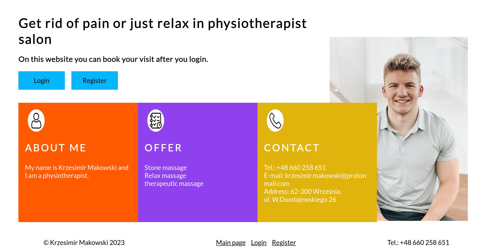
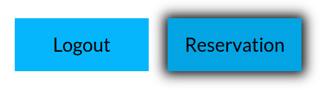
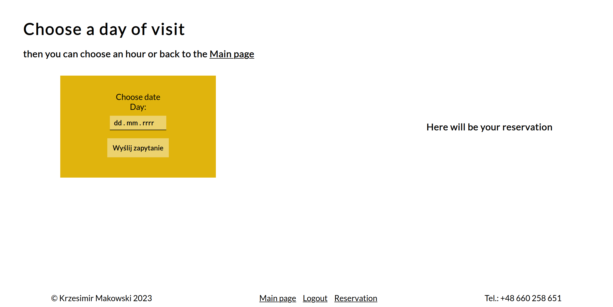
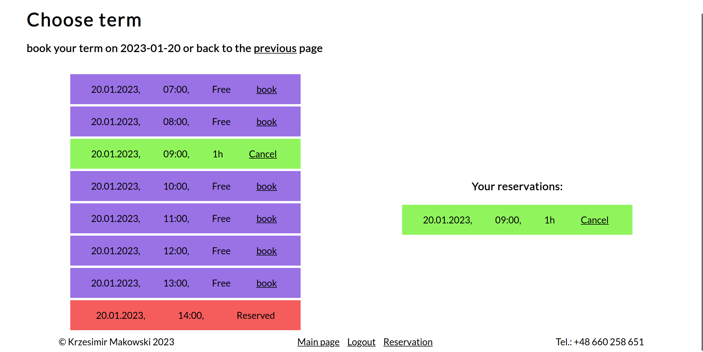
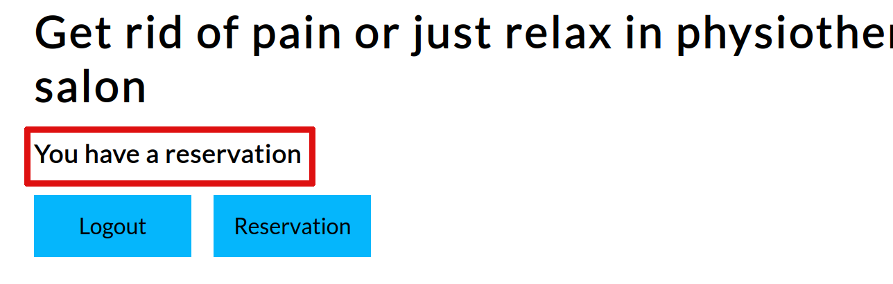

# Physiotherapist's website with reservation function



## Usage

At the beginnig you should register.


Then buttons are changed and you can easley book a free term.



On the next page you can choose when you have time for your massage.



At this moment you can choose your visit and book it. Your reservation will be seen on the right side of the page and on the main page you will see if you have any reservation (without red frame).





## instalation and running on local machine
If you want to test app on your machine you can download repo, make virtual enviroment, download packages and runserver on your computer.
```
git init
git pull https://github.com/Krzesimir04/book_djangoapp
python -m venv env
source env/bin/activate
cd book_proj/
pip install -r requirements.txt
python manage.py runserver
```
If you are using windows use `./env/Scripts/activate` instad of `source env/bin/activate`.

## Additional information

- You can book only 5 visits.
- 